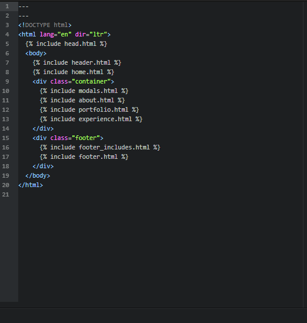
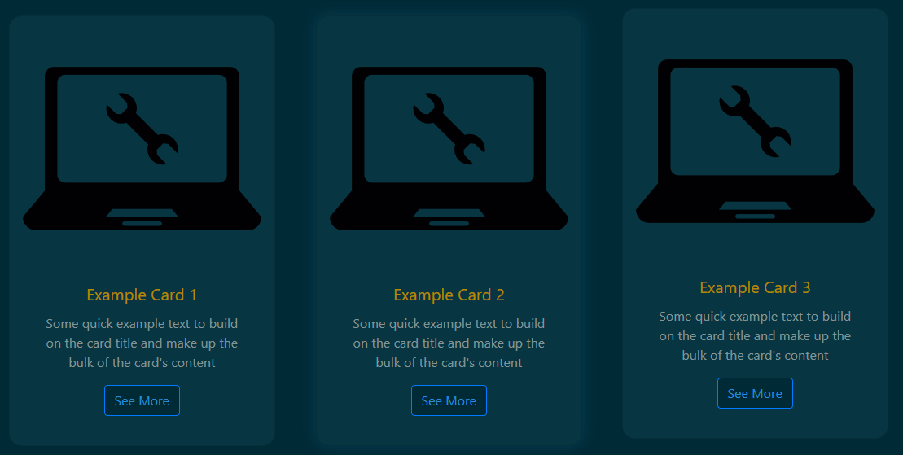
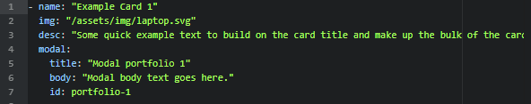
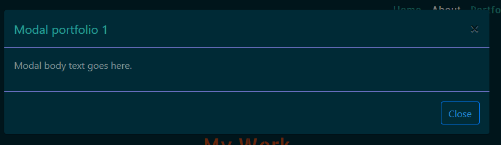
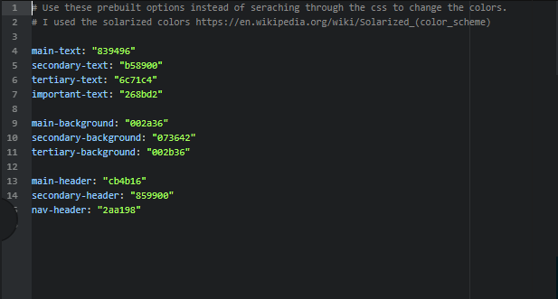
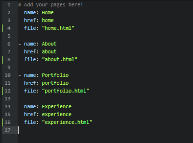
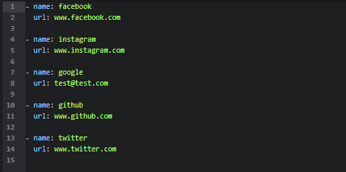

# <span align='center'>🎉🎉🎉 Jekyll Volcanized 🎉🎉🎉</span>

Great, another Jekyll one-page solarized theme, why should I use it?

Well, I will tell you why you might like it

# Table of contents

- [Solarized color palette](#solarized-color-palette)
- [Organized layout](#organized-layout)
- [The _data folder](#the--data-folder)
  * [The `cards.yml` file](#the-cardsyml-file)
  * [The `colors.yml` file](#the-colorsyml-file)
  * [The `pages.yml` file](#the-pagesyml-file)
  * [The `social.yml` file](#the-socialyml-file)
  * [Gem based theme](#gem-based-theme)

- [Completely responsive](#completely-responsive)
- [Jekyll sitemap and SEO](#jekyll-sitemap-and-seo)
- [Installation and usage](#installation-and-usage)
  * [Cloning](#cloning)
- [Licensing and usage](#licensing-and-usage)

<small><i><a href='http://ecotrust-canada.github.io/markdown-toc/'>Table of contents generated with markdown-toc</a></i></small>

# Solarized color palette

Like I said before, this theme uses all colors from the very popular Solarized color scheme made by Ethan Schoonover. The colors are designed to reduce eye strain, especially with the dark theme I went for.

The colors are also very customizable and you can switch off the palette entirely, as the
`/_data/colors.yml`
file works as a mainframe to adjust the colors of the entire website easily, without having to rummage through the CSS.

# Organized layout

Being a one-paged Jekyll theme, I made it as modularized as possible while still maintaining efficiency. All the sections are in separate files which can be included and interchanged in the only `index.html` file.



Many common libraries are already included and installed in both the `head.html` and `footer_includes.html` file for the CSS and JavaScript respectively.

The theme is also purposely left empty so that it can be modified and changed to your will.


# The _data folder

The _data folder includes many options that can be customized.
## The `cards.yml` file
The `cards.yml` file is probably the most robust tool of the `_data` folder. It allows for easy additions to the `portfolio.html` and `modal.html` sections.


The `cards.yml` has **3** basic options(you can add more of course) for the card cover and modal.


The normal, or card section, has:
  1. The `name` of the card, which appears in the cover.
  2. The `img`, which is the path to the image you want as the cover.
  3. The `desc` which is the description that shows on the cover of the card.

The modal section has:
  1. The `title` option which is the title of the modal.
  2. The `body` which is the body of the Modal
  3. And the `id` which is the ID of the modal that the card refers to. Make sure this is unique!


##  The `colors.yml` file
  * This one is pretty self-explanatory, it has an option to change the 10 base colors used and referenced by the CSS file.



## The `pages.yml` file



This is where your navigation bar and section order comes in. Enter your page sections in the corresponding order you want them to appear in.

Simply move around the entries in the order you want them to appear in! The order of the pages will change the order of the sections on the page as well as the order of the pages on the navbar. Scrollspy, smooth scrolling, and directed scrolling are automatically adjusted based on the order of the pages in these files.


## The `social.yml` file


This file is pretty self-explanatory as well. Enter the name of the icon according to [Font Awesome](https://fontawesome.com/icons?d=gallery) and the corresponding URL. These icons are set to be in the footer, but you can put them wherever since they are stored in the `icons.html` file.


## Gem based theme

If you are using a gem based theme, do NOT make your changes or create a `_data` folder. Instead, make a `YAML` array of the values with the name of the `_data` files, such as:
```yaml
cards:
  - name: "Example Card 1"
    img: "/assets/img/laptop.svg"
    desc: "Some quick example text to build on the card title and make up the bulk of the card's content"
    modal:
      title: "Modal portfolio 1"
      body: "Modal body text goes here."
      id: portfolio-1

  - name: "Example Card 2"
    img: "/assets/img/laptop.svg"
    desc: "Some quick example text to build on the card title and make up the bulk of the card's content"
    modal:
      title: "Modal portfolio 2"
      body: "Modal body text goes here."
      id: portfolio-2

  - name: "Example Card 3"
    img: "/assets/img/laptop.svg"
    desc: "Some quick example text to build on the card title and make up the bulk of the card's content"
    modal:
      title: "Modal portfolio 3"
      body: "Modal body text goes here."
      id: portfolio-3

# Colors.yml
# Use these prebuilt options instead of seraching through the css to change the colors.
# I used the solarized colors https://en.wikipedia.org/wiki/Solarized_(color_scheme)

colors:
  main-text: "839496"
  secondary-text: "b58900"
  tertiary-text: "6c71c4"
  important-text: "268bd2"

  main-background: "002a36"
  secondary-background: "073642"
  tertiary-background: "002b36"

  main-header: "cb4b16"
  secondary-header: "859900"
  nav-header: "2aa198"

# Pages.yml

# Add your pages here!
# I have to use pagez because site.pages is already a thing.
pagez:
  - name: Home
    href: home
    file: "home.html"

  - name: About
    href: about
    file: "about.html"

  - name: Portfolio
    href: portfolio
    file: "portfolio.html"

  - name: Experience
    href: experience
    file: "experience.html"

# Social.yml
social:
  - name: facebook
    url: www.facebook.com

  - name: instagram
    url: www.instagram.com

  - name: google
    url: test@test.com

  - name: github
    url: www.github.com

  - name: twitter
    url: www.twitter.com

```

Note that you cannot name the `pages.yml` equivalent pages in the `_config.yml` file because `site.pages` is predefined already.
# Completely responsive

Through media queries and bootstrap, the website was built with responsiveness in mind from the ground up. The website is mobile-first which will increase SEO as well as general usability.

# Jekyll sitemap and SEO

The website is already configured to use both Jekyll sitemap(which can be found at `/sitemap.xml`) and use Jekyll SEO.

# Installation and usage

You can use both cloning and ruby gems to use this theme. I personally think cloning is easier because I enjoy working with the source files, but don't worry if you like gem themes better! There is still full functionality in gem themes.
## Cloning

Run
```git
git clone https://github.com/saleguas/jekyll-volcanized.git
```
To clone the repository and make your changes.

## Gem theme

In your `_config.yml` file, add the line
```yaml
theme: jekyll-volcanized
```
Also add both the `jekyll-seo-tag` and `jekyll-sitemap` plugin
```yaml
plugins:
  - jekyll-feed
  - jekyll-seo-tag
  - jekyll-sitemap
```
and in your `Gemfile` add the lines
```ruby
gem "jekyll-volcanized"
gem "jekyll-seo-tag"
gem "jekyll-sitemap"
```
And your done! Don't forget to run `bundle install` to install the neccessary gems.

The configuration is a bit different for gem themes, which you can find [Here](#gem-based-theme)

# Licensing

The theme is licensed under [MIT licensing](https://choosealicense.com/licenses/mit/) which means anyone is free to use this theme for any reason, including commercially,  without needing to credit me; however, as stated in the licensing, I am not responsibly or liable for anything involving my software. Read the license for more information
