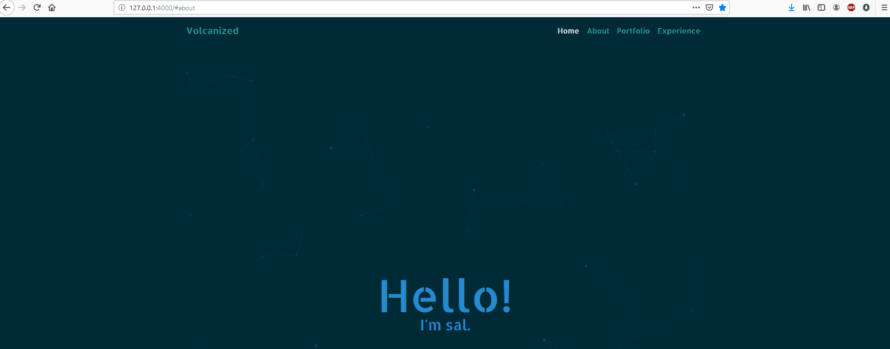

# 🎉🎉🎉 Jekyll Volcanized 🎉🎉🎉

Great, another Jekyll one-page solarized theme, why should I use it?

Well, I will tell you why you might like it

# Solarized color palette

Like I said before, this theme uses all colors from the very popular Solarized color scheme made by Ethan Schoonover. The colors are designed to reduce eye strain, especially with the dark theme I went for.

The colors are also very customizable and you can switch off the palette entirely, as the
`/_data/colors.yml`
file works as a mainframe to adjust the colors of the entire website easily, without having to rummage through the CSS.

# Organized layout

Being a one-paged jekyll theme, I made it as modularized as possible while still maintaining efficiency. All the sections are in separate files which can be included and interchanged in the only `index.html` file.

Many common libraries are already included and installed in both the `head.html` and `footer_includes.html` file for the CSS and JavaScript respectively.

The theme is also purposely left empty so that it can be modified and changed to your will.

# The _data folder

The _data folder includes many options that can be customized.
1. The `cards.yml` file
  * The `cards.yml` file is probably the most robust tool of the `_data` folder. It allows for easy additions to the `portfolio.html` and `modal.html` sections.

  * The `cards.yml` has **3** basic options(you can add more of course) for the card cover and modal.

  * The normal, or card section, has:
    1. The `name` of the card, which appears in the cover.
    2. The `img`, which is the path to the image you want as the cover.
    3. The `desc` which is the description that shows on the cover of the card.
  * The modal section has:
    1. The `title` option which is the title of the modal.
    2. The `body` which is the body of the Modal
    3. And the `id` which is the ID of the modal that the card refers to. Make sure this is unique!

2. The `colors.yml` file
  * This one is pretty self-explanatory, it has an option to change the 10 base colors used and referenced by the CSS file.

3. The `pages.yml` file

  * This is where your navigation bar and section order comes in. Enter your page sections in the corresponding order you want them to appear in.

  * Simply move around the entries in the order you want them to appear in! The order of the pages will change the order of the sections on the page as well as the order of the pages on the navbar. Scrollspy, smooth scrolling, and directed scrolling are automatically adjusted based on the order of the pages in these files.

4. The `social.yml` file

  * This file is pretty self-explanatory as well. Enter the name of the icon according to [Font Awesome](https://fontawesome.com/icons?d=gallery) and the corresponding URL. These icons are set to be in the footer, but you can put them wherever since they are stored in the `icons.html` file.

# Licensing and usage

The theme is licensed under [MIT licensing](https://choosealicense.com/licenses/mit/) which means anyone is free to use this theme for any reason, including commercially,  without needing to credit me; however, as stated in the licensing, I am not responsibly or liable for anything involving my software. Read the license for more information
